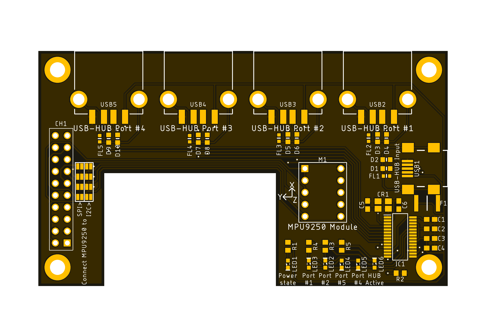

<html lang="en">
  <head>
    <meta charset="uft-8">
    <meta name="author" content="Masato Kubotera">
  </head>
  <body>
    <h1>EN715 Expansion Board Ver. 1.1</h1>
    <h2>About EN715 Expansion Board</h2>
    

      The EN715 Expansion Board is a circuit board to expand the functions of the Carrier Board for NVIDIA Jetson manufactured by AverMedia. 
       
      Note that this is Ver. 1.1. For other versions, please refer to the following repositories.
      <ul>
        <li><a href="https://github.com/MasatoKubotera/EN715_ExpansionBoard_ver1_0">EN715 Expansion Board Ver. 1.0</a></li>
        <li><a href="https://github.com/MasatoKubotera/EN715_ExpansionBoard_ver1_2">EN715 Expansion Board Ver. 1.2</a></li>
      </ul>
      <h2>About Ver. 1.1</h2>
      Ver. 1.1 has the 4-port USB 2.0 Hi-Speed Hub on the board, which can be used by connecting an external USB Mini-B cable. 
      In addition, the MPU-9250 (9-Axis MotionTracking Device Module) module from Strawberry Linux can be installed, and SPI or I2C can be selected as the communication method via a short land on the board. 
      To install in the AverMedia EN715, connect the pin socket to the EN715's "20-pin Expansion header" and secure using 13mm length M3 spacers (e.g. <a href="http://www.hirosugi.jp/products/A/ASL-BE.html">ASL-313BE</a>).  
      It is actually used for the 6th generation robot SUSTAINA-OP of the RoboCup Humanoid League team CIT Brains competed in the RoboCup 2022.  
      <!--
      Ver.1.1 では、基板上に4ポートのUSB 2.0 Hi-Speed  Hubを搭載しており，外付けのUSB Mini-Bケーブルを接続することでことで利用できます．
      また，Strawberry Linux 社の MPU-9250 (9-Axis MotionTracking Device Module) モジュールを装着することができ，基板上のショートランドにより、通信方式としてSPIかI2Cを選択することができます。AverMedia EN715に取り付けるには、ピンソケットをEN715の「20pin Expansion header」に接続し、13mm長のM3スペーサー（例：ASL-313BE）で固定します。
      実際にロボカップ2022に出場したロボカップヒューマノイドリーグチーム「CIT Brains」の第6世代ロボット「SUSTAINA-OP」に使用されています．
      -->
      <table>
        <tr>
          <td>
            <a href="image/brd_bottom.png">
              

                
              

            </a>
          </td>
          <td>
            

              
            

          </td>
          <td>
            

              
            

          </td>
        </tr>
        <tr>
          <td>
            

              PCB preview image
            

          </td>
          <td>
            

              After component mounting
            

          </td>
          <td>
            

              Installed on AverMedia EN715
            

          </td>     
        </tr>
      </table>
    

    <h2>Repository Contents</h2>
    

    <dl>
      <dt>\image</dt>
      <dd>PCB preview images and capture of design screen</dd>
      <dt>\libraries</dt>
      <dd>Libraries used in Autodesk Eagle design</dd>
      <dt>Schematic.pdf</dt>
      <dd>Circuit diagram of this product</dd>
      <dt>BOM.txt</dt>
      <dd>Parts lists output from design data</dd>
      <dt>.brd</dt>
      <dd>Board wiring design file by Autodesk Eagle</dd>
      <dt>.sch</dt>
      <dd>Schematic design file by Autodesk Eagle</dd>
      <dt>Gerber_data.zip</dt>
      <dd>Zip folder of Gerber format files for PCB manufacturing requests.</dd>
      <dt>LICENSE</dt>
      <dd>This is a license to use this product. Please confirm before use.</dd>
      <dt>.gitignore</dt>
      <dd>File to exclude cache files from management.</dd>
    </dl>
    

    <h2>Documentation</h2>
    

    Not created.
    

    <h2>Contact</h2>
    

    If you have any questions, please contact MasatoKubotera, the product's designer, by E-mail.  
    E-mail : <a href="mailto:masatokubotera06@yahoo.co.jp?subject=Questions about EN715 Expansion Board Ver. 1.1">masatokubotera06@yahoo.co.jp</a>
    

    <h2>License Information</h2>
    

      This product is open source. 
      Please review the <a href="https://github.com/MasatoKubotera/EN715_ExpansionBoard_ver1_1/blob/master/LICENSE">LICENSE file</a> for license information. 
       
      <strong>EN715 Expansion Board Ver. 1.1</strong> by Masato Kubotera is licensed under a <a href="http://creativecommons.org/licenses/by-nc-sa/4.0/">Creative Commons Attribution-NonCommercial-ShareAlike 4.0 International License</a>.
    
    
  </body>
</html>
